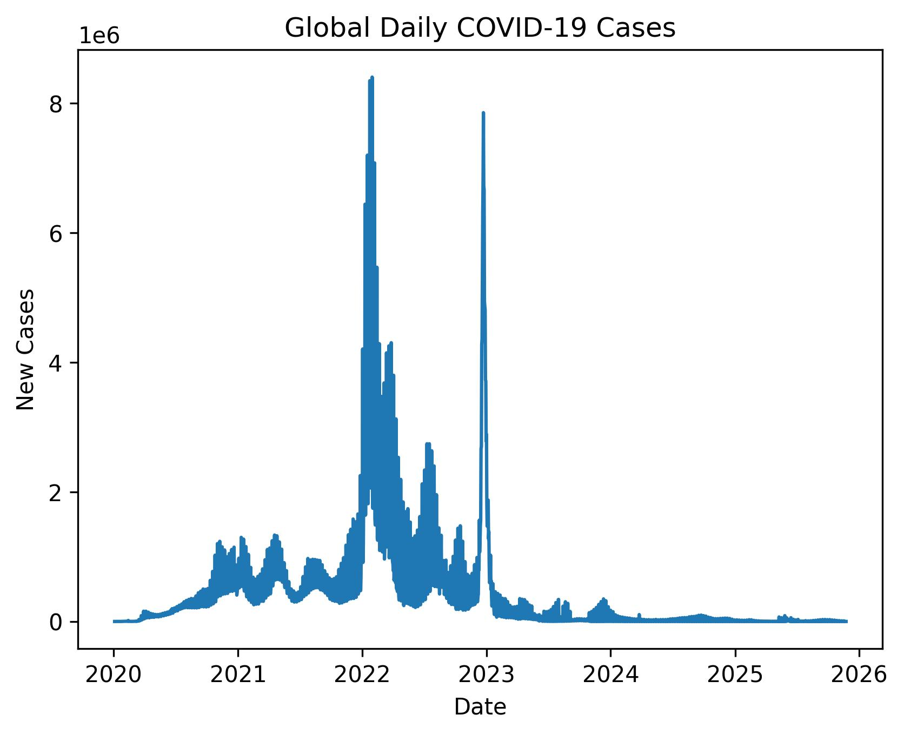
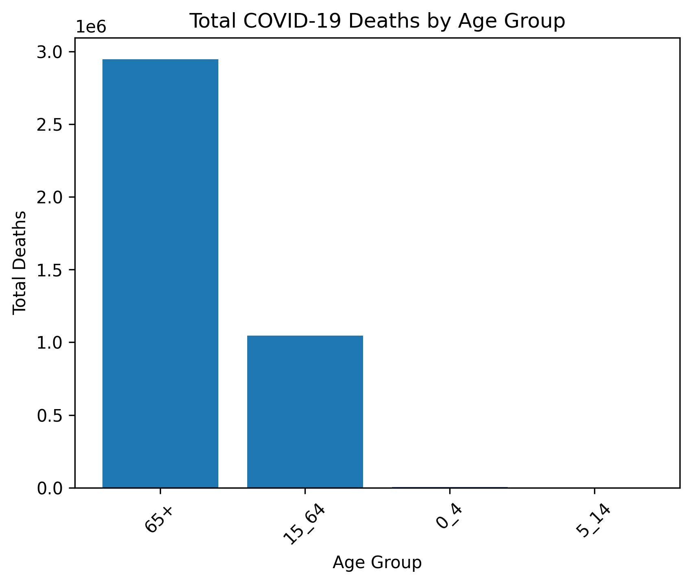

# WHO COVID-19 Global Trends Analysis

This project analyzes global COVID-19 case trends and the demographic impact across age groups using publicly available WHO data.
It highlights key waves, peak periods, and the age groups most affected by COVID-19.

---

## 🗂️ Project Structure
```
who_covid_global_trend/
│
├── data/
│   ├── who_covid_global_daily.csv
│   └── who_covid_monthly_deaths_by_age.csv
├── covid_analysis.ipynb
├── global_daily_cases.jpeg
├── deaths_by_age_group.jpeg
└── README.md
```


---

## 🛠️ Tools Used

- Python
- Pandas
- Matplotlib
- Jupyter Notebook
- VS Code (for editing)

---

## 📊 Visualizations

### Global Daily COVID-19 Cases


**Insight:**
The global daily case count shows multiple waves over time, reflecting periods of rapid transmission followed by declines.


### Total COVID-19 Deaths by Age Group


**Insight:**
COVID-19 deaths are heavily concentrated in older age groups, highlighting age as a major risk factor.

---

## 🔹 Key Insights

- Global COVID-19 cases exhibited multiple waves over time.
- Older age groups experienced a disproportionately higher number of deaths.
- Analysis is based on reported WHO data; underreporting or delays may affect results.

---

## ⚠️ Notes & Limitations

- Missing daily values in the WHO data were treated as 0 reported cases or deaths.
- Analysis is limited to the provided datasets; global totals may differ due to underreporting.
- Only two datasets were used to keep the analysis focused and interpretable.

---

## 📌 How to Use

1. Open `covid_analysis.ipynb` in Jupyter Notebook.
2. Run cells in order to reproduce the cleaning, analysis, and visualizations.
3. The plots are also saved as JPEGs (`global_daily_cases.jpeg` and `deaths_by_age_group.jpeg`) for reference or inclusion in other documents.
